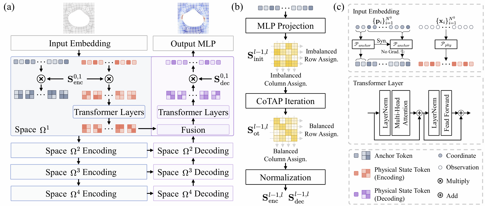
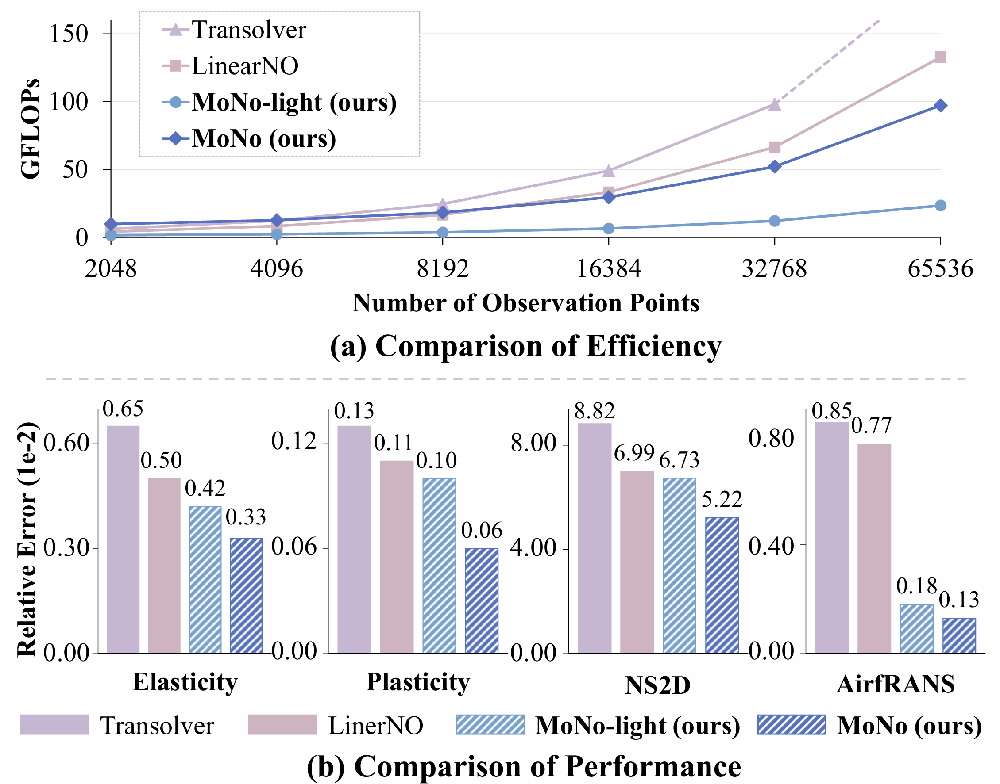

# MoNo: Multiscale Optimal Transport Neural Operator for Solving PDEs on General Geometries

<div align="center">

<a href=''></a>
<a href='https://github.com/ZijiangY1116/MoNo'></a>
<a href='https://huggingface.co/datasets/ZijiangY/MoNo'></a>

</div>

This is the official code repository for the paper "MoNo: Multiscale Optimal Transport Neural Operator for Solving PDEs on General Geometries".

<div  align="center">

</div>

Transformer-based neural operators have achieved substantial progress in solving Partial Differential Equations (PDEs) by projecting spatial observations into compact latent tokens and learning physical interactions in latent spaces. However, we reveal that existing learnable projection mechanisms cannot ensure stable and balanced assignments from observation points to latent tokens, causing some latent tokens to be over-assigned while others remain underutilized. This limitation further restricts the design of hierarchical architectures, as assignment imbalance is continuously inherited and amplified across latent spaces, eventually causing severe token collapse in deeper spaces. To address these issues, we propose **MoNo** (**M**ultiscale **O**ptimal Transport **N**eural **O**perator), a progressive multiscale neural operator that efficiently solves PDEs on general geometries through stable latent-space construction. At its core is **CoTAP** (**C**ross-scale **O**ptimal **T**ransport **A**ssignment and **P**rojection), a novel latent-space construction method that formulates cross-space assignment between adjacent spaces as an entropy-regularized optimal transport problem, thereby constructing balanced bidirectional projections and stable latent spaces. CoTAP also ensures stable information transfer across multiple latent spaces, further enabling multiscale architectures on general geometries, which in turn support more efficient learning of long-range physical interactions. Extensive experiments demonstrate that MoNo outperforms existing state-of-the-art neural operators in both prediction performance and computational efficiency.

## Environment Setup

```bash
conda create --name MoNo python=3.10
conda activate MoNo

# Install uv.
pip install uv

# PyTorch 2.8.0 + CUDA 12.8.
uv pip install torch==2.8.0 torchvision==0.23.0 torchaudio==2.8.0

# Install the remaining dependencies.
uv pip install -r requirements.txt
```

## Data Preparation

Download the raw datasets from their original sources and place them under a local raw-data directory. The preprocessing scripts write training and test data to `./dataset` by default.

| Dataset | Source |
| --- | --- |
| Airfoil | [Google Drive](https://drive.google.com/drive/folders/1YBuaoTdOSr_qzaow-G-iwvbUI7fiUzu8) |
| Darcy | [Google Drive](https://drive.google.com/drive/folders/1UnbQh2WWc6knEHbLn-ZaXrKUZhp7pjt-) |
| Elasticity | [Google Drive](https://drive.google.com/drive/folders/1YBuaoTdOSr_qzaow-G-iwvbUI7fiUzu8) |
| Pipe | [Google Drive](https://drive.google.com/drive/folders/1YBuaoTdOSr_qzaow-G-iwvbUI7fiUzu8) |
| Plasticity | [Google Drive](https://drive.google.com/drive/folders/1YBuaoTdOSr_qzaow-G-iwvbUI7fiUzu8) |
| NS2d | [Google Drive](https://drive.google.com/drive/folders/1UnbQh2WWc6knEHbLn-ZaXrKUZhp7pjt-) |
| AirfRANS | [AirfRANS](https://data.isir.upmc.fr/extrality/NeurIPS_2022/Dataset.zip) |

* Airfoil

`/path/to/Airfoil` should contain the `naca` directory with `NACA_Cylinder_Q.npy`, `NACA_Cylinder_X.npy`, and `NACA_Cylinder_Y.npy`.

```bash
python preprocess/prepare_airfoil.py --input_dir /path/to/Airfoil
```

* Darcy

```bash
python preprocess/prepare_darcy.py --input_paths /path/to/piececonst_r421_N1024_smooth1.mat /path/to/piececonst_r421_N1024_smooth2.mat --obj_res %OBJ_RES
```

where `%OBJ_RES` is the target resolution. Set `%OBJ_RES` to `85`, `141`, and `211` respectively to prepare the datasets used in the multi-resolution experiments.

* Elasticity

`/path/to/Elasticity` should contain the `Meshes` directory.

```bash
python preprocess/prepare_elasticity.py --input_dir /path/to/Elasticity
```

* Pipe

Use `/path/to/Pipe` as the directory containing the raw Pipe dataset.

```bash
python preprocess/prepare_pipe.py --input_dir /path/to/Pipe
```

* Plasticity

Use `plas_N987_T20.mat` as the raw Plasticity data file:

```bash
python preprocess/prepare_plasticity.py --input_path /path/to/plas_N987_T20.mat
```

* NS2d

Use `NavierStokes_V1e-5_N1200_T20.mat` as the raw NS2d data file:

```bash
python preprocess/prepare_ns2d.py --input_path /path/to/NavierStokes_V1e-5_N1200_T20.mat
```

* AirfRANS

```bash
python preprocess/prepare_airfrans.py --input_dir /path/to/airrans --tasks full reynolds aoa
```

For reproducible evaluation, download the prepared evaluation sampling sequences for the standard and OOD experiments from [AirfRANS (full)](https://huggingface.co/datasets/ZijiangY/MoNo/blob/main/dataset/airfrans_full.zip), [AirfRANS (reynolds)](https://huggingface.co/datasets/ZijiangY/MoNo/blob/main/dataset/airfrans_reynolds.zip), and [AirfRANS (aoa)](https://huggingface.co/datasets/ZijiangY/MoNo/blob/main/dataset/airfrans_aoa.zip). Extract each archive into the corresponding preprocessed dataset directory under `eval_sampling/32000/all_surface`. For example, the files in [AirfRANS (full)](https://huggingface.co/datasets/ZijiangY/MoNo/blob/main/dataset/airfrans_full.zip) should be extracted to `./dataset/airfrans_full/eval_sampling/32000/all_surface`. In this repository, `airfrans_aoa` denotes the OOD Angles benchmark used in the paper and result tables.

Alternatively, you can use `preprocess/prepare_airfrans_eval_sampling.py` to generate the AirfRANS evaluation sampling sequences locally.

```bash
python preprocess/prepare_airfrans_eval_sampling.py --tasks %TASK --subsamplings %SUBSAMPLING
```

where `%TASK` is one or more AirfRANS tasks selected from `full`, `reynolds`, and `aoa`, and `%SUBSAMPLING` is the number of points sampled per inference pass. Set `%SUBSAMPLING` to `32000` for the evaluation setting used in this project. The script reads the preprocessed datasets from `./dataset` and generates the sampling files under each corresponding `eval_sampling/%SUBSAMPLING/all_surface` directory by default.

Note that sampling sequences generated locally may differ from those provided here due to differences in hardware and software environments, which may lead to variations in the evaluation results. To reproduce the results reported in the paper, we strongly recommend using the pre-generated evaluation sampling sequences provided above.

## Pre-trained Models and Results

<div  align="center">

</div>

The pre-trained models of MoNo are available at [MoNo (HuggingFace)](https://huggingface.co/datasets/ZijiangY/MoNo).

### Standard Benchmarks

<table>
    <thead>
        <tr>
            <th style="text-align: center; vertical-align: middle;">Benchmark</th>
            <th style="text-align: center; vertical-align: middle;">Model</th>
            <th style="text-align: center; vertical-align: middle;">Weight Link</th>
            <th style="text-align: center; vertical-align: middle;">Log Link</th>
            <th style="text-align: center; vertical-align: middle;">Relative L2 &darr;</th>
        </tr>
    </thead>
    <tbody>
        <tr>
            <td rowspan="2" style="text-align: center; vertical-align: middle;">Airfoil</td>
            <td style="text-align: center;">MoNo-Light</td>
            <td style="text-align: center;"><a href="https://huggingface.co/datasets/ZijiangY/MoNo/blob/main/pretrained/MoNo-light/airfoil/checkpoint/last.pt">Download</a></td>
            <td style="text-align: center;"><a href="https://huggingface.co/datasets/ZijiangY/MoNo/blob/main/pretrained/MoNo-light/airfoil/log/log.txt">Download</a></td>
            <td style="text-align: center;">0.0048</td>
        </tr>
        <tr>
            <td style="text-align: center;">MoNo</td>
            <td style="text-align: center;"><a href="https://huggingface.co/datasets/ZijiangY/MoNo/blob/main/pretrained/MoNo/airfoil/checkpoint/last.pt">Download</a></td>
            <td style="text-align: center;"><a href="https://huggingface.co/datasets/ZijiangY/MoNo/blob/main/pretrained/MoNo/airfoil/log/log.txt">Download</a></td>
            <td style="text-align: center;">0.0048</td>
        </tr>
        <tr>
            <td rowspan="2" style="text-align: center; vertical-align: middle;">Pipe</td>
            <td style="text-align: center;">MoNo-Light</td>
            <td style="text-align: center;"><a href="https://huggingface.co/datasets/ZijiangY/MoNo/blob/main/pretrained/MoNo-light/pipe/checkpoint/last.pt">Download</a></td>
            <td style="text-align: center;"><a href="https://huggingface.co/datasets/ZijiangY/MoNo/blob/main/pretrained/MoNo-light/pipe/log/log.txt">Download</a></td>
            <td style="text-align: center;">0.0027</td>
        </tr>
        <tr>
            <td style="text-align: center;">MoNo</td>
            <td style="text-align: center;"><a href="https://huggingface.co/datasets/ZijiangY/MoNo/blob/main/pretrained/MoNo/pipe/checkpoint/last.pt">Download</a></td>
            <td style="text-align: center;"><a href="https://huggingface.co/datasets/ZijiangY/MoNo/blob/main/pretrained/MoNo/pipe/log/log.txt">Download</a></td>
            <td style="text-align: center;">0.0021</td>
        </tr>
        <tr>
            <td rowspan="2" style="text-align: center; vertical-align: middle;">Plasticity</td>
            <td style="text-align: center;">MoNo-Light</td>
            <td style="text-align: center;"><a href="https://huggingface.co/datasets/ZijiangY/MoNo/blob/main/pretrained/MoNo-light/plasticity/checkpoint/last.pt">Download</a></td>
            <td style="text-align: center;"><a href="https://huggingface.co/datasets/ZijiangY/MoNo/blob/main/pretrained/MoNo-light/plasticity/log/log.txt">Download</a></td>
            <td style="text-align: center;">0.0010</td>
        </tr>
        <tr>
            <td style="text-align: center;">MoNo</td>
            <td style="text-align: center;"><a href="https://huggingface.co/datasets/ZijiangY/MoNo/blob/main/pretrained/MoNo/plasticity/checkpoint/last.pt">Download</a></td>
            <td style="text-align: center;"><a href="https://huggingface.co/datasets/ZijiangY/MoNo/blob/main/pretrained/MoNo/plasticity/log/log.txt">Download</a></td>
            <td style="text-align: center;">0.0006</td>
        </tr>
        <tr>
            <td rowspan="2" style="text-align: center; vertical-align: middle;">Navier-Stokes</td>
            <td style="text-align: center;">MoNo-Light</td>
            <td style="text-align: center;"><a href="https://huggingface.co/datasets/ZijiangY/MoNo/blob/main/pretrained/MoNo-light/ns2d/checkpoint/last.pt">Download</a></td>
            <td style="text-align: center;"><a href="https://huggingface.co/datasets/ZijiangY/MoNo/blob/main/pretrained/MoNo-light/ns2d/log/log.txt">Download</a></td>
            <td style="text-align: center;">0.0673</td>
        </tr>
        <tr>
            <td style="text-align: center;">MoNo</td>
            <td style="text-align: center;"><a href="https://huggingface.co/datasets/ZijiangY/MoNo/blob/main/pretrained/MoNo/ns2d/checkpoint/last.pt">Download</a></td>
            <td style="text-align: center;"><a href="https://huggingface.co/datasets/ZijiangY/MoNo/blob/main/pretrained/MoNo/ns2d/log/log.txt">Download</a></td>
            <td style="text-align: center;">0.0522</td>
        </tr>
        <tr>
            <td rowspan="2" style="text-align: center; vertical-align: middle;">Elasticity</td>
            <td style="text-align: center;">MoNo-Light</td>
            <td style="text-align: center;"><a href="https://huggingface.co/datasets/ZijiangY/MoNo/blob/main/pretrained/MoNo-light/elasticity/checkpoint/last.pt">Download</a></td>
            <td style="text-align: center;"><a href="https://huggingface.co/datasets/ZijiangY/MoNo/blob/main/pretrained/MoNo-light/elasticity/log/log.txt">Download</a></td>
            <td style="text-align: center;">0.0042</td>
        </tr>
        <tr>
            <td style="text-align: center;">MoNo</td>
            <td style="text-align: center;"><a href="https://huggingface.co/datasets/ZijiangY/MoNo/blob/main/pretrained/MoNo/elasticity/checkpoint/last.pt">Download</a></td>
            <td style="text-align: center;"><a href="https://huggingface.co/datasets/ZijiangY/MoNo/blob/main/pretrained/MoNo/elasticity/log/log.txt">Download</a></td>
            <td style="text-align: center;">0.0033</td>
        </tr>
    </tbody>
</table>

### AirfRANS

<table>
    <thead>
        <tr>
            <th style="text-align: center; vertical-align: middle;">Benchmark</th>
            <th style="text-align: center; vertical-align: middle;">Model</th>
            <th style="text-align: center; vertical-align: middle;">Weight Link</th>
            <th style="text-align: center; vertical-align: middle;">Log Link</th>
            <th style="text-align: center; vertical-align: middle;">Vol. &darr;</th>
            <th style="text-align: center; vertical-align: middle;">Surf. &darr;</th>
        </tr>
    </thead>
    <tbody>
        <tr>
            <td rowspan="2" style="text-align: center; vertical-align: middle;">AirfRANS (Full)</td>
            <td style="text-align: center;">MoNo-Light</td>
            <td style="text-align: center;"><a href="https://huggingface.co/datasets/ZijiangY/MoNo/blob/main/pretrained/MoNo-light/airfrans_full/checkpoint/last.pt">Download</a></td>
            <td style="text-align: center;"><a href="https://huggingface.co/datasets/ZijiangY/MoNo/blob/main/pretrained/MoNo-light/airfrans_full/log/log.txt">Download</a></td>
            <td style="text-align: center;">0.0025</td>
            <td style="text-align: center;">0.0018</td>
        </tr>
        <tr>
            <td style="text-align: center;">MoNo</td>
            <td style="text-align: center;"><a href="https://huggingface.co/datasets/ZijiangY/MoNo/blob/main/pretrained/MoNo/airfrans_full/checkpoint/last.pt">Download</a></td>
            <td style="text-align: center;"><a href="https://huggingface.co/datasets/ZijiangY/MoNo/blob/main/pretrained/MoNo/airfrans_full/log/log.txt">Download</a></td>
            <td style="text-align: center;">0.0009</td>
            <td style="text-align: center;">0.0013</td>
        </tr>
        <tr>
            <td rowspan="2" style="text-align: center; vertical-align: middle;">OOD Reynolds</td>
            <td style="text-align: center;">MoNo-Light</td>
            <td style="text-align: center;"><a href="https://huggingface.co/datasets/ZijiangY/MoNo/blob/main/pretrained/MoNo-light/airfrans_reynolds/checkpoint/last.pt">Download</a></td>
            <td style="text-align: center;"><a href="https://huggingface.co/datasets/ZijiangY/MoNo/blob/main/pretrained/MoNo-light/airfrans_reynolds/log/log.txt">Download</a></td>
            <td style="text-align: center;">0.0090</td>
            <td style="text-align: center;">0.0146</td>
        </tr>
        <tr>
            <td style="text-align: center;">MoNo</td>
            <td style="text-align: center;"><a href="https://huggingface.co/datasets/ZijiangY/MoNo/blob/main/pretrained/MoNo/airfrans_reynolds/checkpoint/last.pt">Download</a></td>
            <td style="text-align: center;"><a href="https://huggingface.co/datasets/ZijiangY/MoNo/blob/main/pretrained/MoNo/airfrans_reynolds/log/log.txt">Download</a></td>
            <td style="text-align: center;">0.0066</td>
            <td style="text-align: center;">0.0121</td>
        </tr>
        <tr>
            <td rowspan="2" style="text-align: center; vertical-align: middle;">OOD Angles</td>
            <td style="text-align: center;">MoNo-Light</td>
            <td style="text-align: center;"><a href="https://huggingface.co/datasets/ZijiangY/MoNo/blob/main/pretrained/MoNo-light/airfrans_angles/checkpoint/last.pt">Download</a></td>
            <td style="text-align: center;"><a href="https://huggingface.co/datasets/ZijiangY/MoNo/blob/main/pretrained/MoNo-light/airfrans_angles/log/log.txt">Download</a></td>
            <td style="text-align: center;">0.0222</td>
            <td style="text-align: center;">0.0553</td>
        </tr>
        <tr>
            <td style="text-align: center;">MoNo</td>
            <td style="text-align: center;"><a href="https://huggingface.co/datasets/ZijiangY/MoNo/blob/main/pretrained/MoNo/airfrans_angles/checkpoint/last.pt">Download</a></td>
            <td style="text-align: center;"><a href="https://huggingface.co/datasets/ZijiangY/MoNo/blob/main/pretrained/MoNo/airfrans_angles/log/log.txt">Download</a></td>
            <td style="text-align: center;">0.0097</td>
            <td style="text-align: center;">0.0248</td>
        </tr>
    </tbody>
</table>

### Evaluation at Multiple Resolutions

<table>
    <thead>
        <tr>
            <th style="text-align: center; vertical-align: middle;">Benchmark</th>
            <th style="text-align: center; vertical-align: middle;">Model</th>
            <th style="text-align: center; vertical-align: middle;">Weight Link</th>
            <th style="text-align: center; vertical-align: middle;">Log Link</th>
            <th style="text-align: center; vertical-align: middle;">Relative L2 &darr;</th>
        </tr>
    </thead>
    <tbody>
        <tr>
            <td rowspan="2" style="text-align: center; vertical-align: middle;">Darcy 85&times;85</td>
            <td style="text-align: center;">MoNo-Light</td>
            <td style="text-align: center;"><a href="https://huggingface.co/datasets/ZijiangY/MoNo/blob/main/pretrained/MoNo-light/darcy85/checkpoint/last.pt">Download</a></td>
            <td style="text-align: center;"><a href="https://huggingface.co/datasets/ZijiangY/MoNo/blob/main/pretrained/MoNo-light/darcy85/log/log.txt">Download</a></td>
            <td style="text-align: center;">0.0070</td>
        </tr>
        <tr>
            <td style="text-align: center;">MoNo</td>
            <td style="text-align: center;"><a href="https://huggingface.co/datasets/ZijiangY/MoNo/blob/main/pretrained/MoNo/darcy85/checkpoint/last.pt">Download</a></td>
            <td style="text-align: center;"><a href="https://huggingface.co/datasets/ZijiangY/MoNo/blob/main/pretrained/MoNo/darcy85/log/log.txt">Download</a></td>
            <td style="text-align: center;">0.0059</td>
        </tr>
        <tr>
            <td rowspan="2" style="text-align: center; vertical-align: middle;">Darcy 141&times;141</td>
            <td style="text-align: center;">MoNo-Light</td>
            <td style="text-align: center;"><a href="https://huggingface.co/datasets/ZijiangY/MoNo/blob/main/pretrained/MoNo-light/darcy141/checkpoint/last.pt">Download</a></td>
            <td style="text-align: center;"><a href="https://huggingface.co/datasets/ZijiangY/MoNo/blob/main/pretrained/MoNo-light/darcy141/log/log.txt">Download</a></td>
            <td style="text-align: center;">0.0057</td>
        </tr>
        <tr>
            <td style="text-align: center;">MoNo</td>
            <td style="text-align: center;"><a href="https://huggingface.co/datasets/ZijiangY/MoNo/blob/main/pretrained/MoNo/darcy141/checkpoint/last.pt">Download</a></td>
            <td style="text-align: center;"><a href="https://huggingface.co/datasets/ZijiangY/MoNo/blob/main/pretrained/MoNo/darcy141/log/log.txt">Download</a></td>
            <td style="text-align: center;">0.0049</td>
        </tr>
        <tr>
            <td rowspan="2" style="text-align: center; vertical-align: middle;">Darcy 211&times;211</td>
            <td style="text-align: center;">MoNo-Light</td>
            <td style="text-align: center;"><a href="https://huggingface.co/datasets/ZijiangY/MoNo/blob/main/pretrained/MoNo-light/darcy211/checkpoint/last.pt">Download</a></td>
            <td style="text-align: center;"><a href="https://huggingface.co/datasets/ZijiangY/MoNo/blob/main/pretrained/MoNo-light/darcy211/log/log.txt">Download</a></td>
            <td style="text-align: center;">0.0059</td>
        </tr>
        <tr>
            <td style="text-align: center;">MoNo</td>
            <td style="text-align: center;"><a href="https://huggingface.co/datasets/ZijiangY/MoNo/blob/main/pretrained/MoNo/darcy211/checkpoint/last.pt">Download</a></td>
            <td style="text-align: center;"><a href="https://huggingface.co/datasets/ZijiangY/MoNo/blob/main/pretrained/MoNo/darcy211/log/log.txt">Download</a></td>
            <td style="text-align: center;">0.0046</td>
        </tr>
    </tbody>
</table>

## Quick Start

### Training

To reproduce the results of MoNo and MoNo-Light on all benchmarks, launch an experiment with:

```bash
python exp.py --config %CONFIG_FILE
```

where `%CONFIG_FILE` is the path to the YAML configuration for the selected model and benchmark. The `./conf` directory contains the complete configurations for all released experiments, as listed below.

| Benchmark | MoNo-Light | MoNo |
| --- | --- | --- |
| Airfoil | [`mono-light_airfoil.yaml`](./conf/mono-light_airfoil.yaml) | [`mono_airfoil.yaml`](./conf/mono_airfoil.yaml) |
| Pipe | [`mono-light_pipe.yaml`](./conf/mono-light_pipe.yaml) | [`mono_pipe.yaml`](./conf/mono_pipe.yaml) |
| Plasticity | [`mono-light_plasticity.yaml`](./conf/mono-light_plasticity.yaml) | [`mono_plasticity.yaml`](./conf/mono_plasticity.yaml) |
| Navier-Stokes | [`mono-light_ns2d.yaml`](./conf/mono-light_ns2d.yaml) | [`mono_ns2d.yaml`](./conf/mono_ns2d.yaml) |
| Elasticity | [`mono-light_elasticity.yaml`](./conf/mono-light_elasticity.yaml) | [`mono_elasticity.yaml`](./conf/mono_elasticity.yaml) |
| AirfRANS (Full) | [`mono-light_airfrans_full.yaml`](./conf/mono-light_airfrans_full.yaml) | [`mono_airfrans_full.yaml`](./conf/mono_airfrans_full.yaml) |
| AirfRANS (OOD Reynolds) | [`mono-light_airfrans_reynolds.yaml`](./conf/mono-light_airfrans_reynolds.yaml) | [`mono_airfrans_reynolds.yaml`](./conf/mono_airfrans_reynolds.yaml) |
| AirfRANS (OOD Angles) | [`mono-light_airfrans_aoa.yaml`](./conf/mono-light_airfrans_aoa.yaml) | [`mono_airfrans_aoa.yaml`](./conf/mono_airfrans_aoa.yaml) |
| Darcy 85 | [`mono-light_darcy85.yaml`](./conf/mono-light_darcy85.yaml) | [`mono_darcy85.yaml`](./conf/mono_darcy85.yaml) |
| Darcy 141 | [`mono-light_darcy141.yaml`](./conf/mono-light_darcy141.yaml) | [`mono_darcy141.yaml`](./conf/mono_darcy141.yaml) |
| Darcy 211 | [`mono-light_darcy211.yaml`](./conf/mono-light_darcy211.yaml) | [`mono_darcy211.yaml`](./conf/mono_darcy211.yaml) |

Training records, TensorBoard logs, checkpoints, saved arguments, and final validation metrics are written under `./outputs/<timestamp>_<experiment-name>/`.

### Evaluation

After training, `exp.py` automatically runs evaluation using the **latest** checkpoint. We do not perform any model selection.

You can also evaluate a saved experiment independently with:

```bash
python eval.py --exp_folder %EXP_FOLDER
```

where `%EXP_FOLDER` is the experiment directory name under `./outputs` or the path to a complete experiment directory. Pre-trained models downloaded from Hugging Face can be evaluated in exactly the same way by passing the local pre-trained experiment folder to `%EXP_FOLDER`.

By default, evaluation uses the latest numeric checkpoint. A specific epoch can instead be evaluated with `--checkpoint_epoch`. If an experiment contains no numeric checkpoint but provides `checkpoint/last.pt`, as in the released pre-trained experiments, `eval.py` loads `last.pt` automatically. Evaluation metrics are saved to `<experiment>/test/res.json`.

## License

The code is released under the Apache 2.0 license as found in the [LICENSE](./LICENSE) file.
